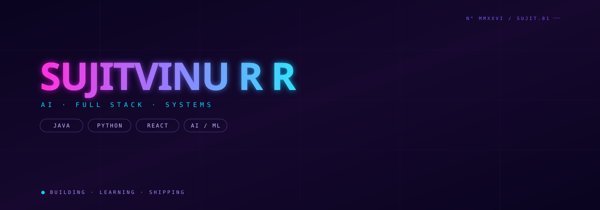

<!-- =========================================================
     SUJITVINU R R — GitHub Profile README
     ========================================================= -->

  

  

  
  

  

<h2>⚡ SYSTEM PROFILE</h2>

  

⚡ What I'm Building

<table>
<tr>
<td width="33%" align="center">

🤖 AI Engineering

Machine learning systems, computer vision and intelligent applications.

</td>
<td width="33%" align="center">

🌐 Full Stack

Modern frontend + scalable backend + databases + APIs.

</td>
<td width="33%" align="center">

⚙️ Real-Time Systems

Streaming telemetry, WebSockets, dashboards and live intelligence.

</td>
</tr>
</table>

🚀 Featured Engineering Projects

<table>
<tr>
<td width="50%" valign="top">

✈️ AERO TWIN

AI-Enabled Digital Twin

A real-time digital twin platform for monitoring aero piston engine health,
detecting anomalies and supporting mission reliability analysis.

Engineering

Python FastAPI React TypeScript Three.js WebSocket ML

Architecture

Telemetry → Processing → ML → Digital Twin → Visualization → Alerts

</td>

<td width="50%" valign="top">

🏥 MEDCARE

Medical AI Platform

An AI-powered healthcare system combining computer vision, intelligent
assistance and real-time communication workflows.

Engineering

Python FastAPI OpenCV MediaPipe React AI

Focus

Computer Vision → Analysis → AI Assistance → Communication

</td>
</tr>

<tr>
<td width="50%" valign="top">

🕶️ SMARTSPECS

Assistive Computer Vision

A smart-glasses concept using computer vision and embedded intelligence
to assist visually impaired users.

Engineering

Computer Vision AI IoT Embedded Systems

Focus

Perception → Understanding → Assistance

</td>

<td width="50%" valign="top">

🌊 MARINA

Water Intelligence Platform

An intelligent monitoring concept combining IoT data, analytics,
geospatial visualization and environmental intelligence.

Engineering

IoT AI Maps React Data Visualization

Focus

Sensors → Data → Analytics → Geospatial Intelligence

</td>
</tr>
</table>

🧠 Technical Arsenal

Languages

  

Frontend Engineering

  

Backend & Data

  

AI / ML / Vision

  

Engineering Tools

  

🏗️ How I Think About Systems

                         ┌─────────────────────┐
                         │       PROBLEM       │
                         └──────────┬──────────┘
                                    │
                                    ▼
                         ┌─────────────────────┐
                         │   SYSTEM DESIGN     │
                         └──────────┬──────────┘
                                    │
                  ┌─────────────────┼─────────────────┐
                  ▼                 ▼                 ▼
             FRONTEND           BACKEND             AI/ML
                  │                 │                 │
                  └─────────────────┼─────────────────┘
                                    ▼
                         ┌─────────────────────┐
                         │     DATA LAYER      │
                         └──────────┬──────────┘
                                    │
                                    ▼
                         ┌─────────────────────┐
                         │ REAL-TIME / EVENTS  │
                         └──────────┬──────────┘
                                    │
                                    ▼
                         ┌─────────────────────┐
                         │  INTELLIGENT UI     │
                         └─────────────────────┘

# 📊 GitHub Intelligence

  
  

# 🐍 Contribution Intelligence

  <picture>
    <source
      media="(prefers-color-scheme: dark)"
      srcset="https://raw.githubusercontent.com/sujitvinu123/sujitvinu123/output/github-snake-dark.svg"
    />
    <source
      media="(prefers-color-scheme: light)"
      srcset="https://raw.githubusercontent.com/sujitvinu123/sujitvinu123/output/github-snake.svg"
    />
    
  </picture>

# 💻 LeetCode Intelligence

  

  

<!-- ==================== CODING ACTIVITY ==================== -->

<h2>⌨️ CODING ACTIVITY</h2>

  

🎯 Current Mission

<table>
<tr>
<td>

📌 Building

AERO TWIN

AI + Digital Twin + Real-Time Telemetry + 3D Visualization

</td>
<td>

🧩 Improving

Data Structures & Algorithms

Java • Queues • DP • Problem Solving

</td>
</tr>
<tr>
<td>

🤖 Exploring

AI Engineering

ML • Computer Vision • Intelligent Systems

</td>
<td>

🌐 Developing

Full Stack Systems

React • FastAPI • PostgreSQL • WebSockets

</td>
</tr>
</table>

📚 Learning Roadmap

                    SOFTWARE ENGINEERING
                           │
        ┌──────────────────┼──────────────────┐
        ▼                  ▼                  ▼
       DSA              SYSTEMS             AI/ML
        │                  │                  │
     Java              Backend             Models
     Queues            APIs                 Vision
     DP                Databases            Inference
     Graphs            WebSockets           Deployment
        │                  │                  │
        └──────────────────┼──────────────────┘
                           ▼
                    REAL APPLICATIONS
                           │
                           ▼
                    BUILD • TEST • SHIP

📫 Connect

  
  
  

  <strong>⚡ BUILD • LEARN • EXPERIMENT • SHIP</strong>

  Profile continuously evolving.

